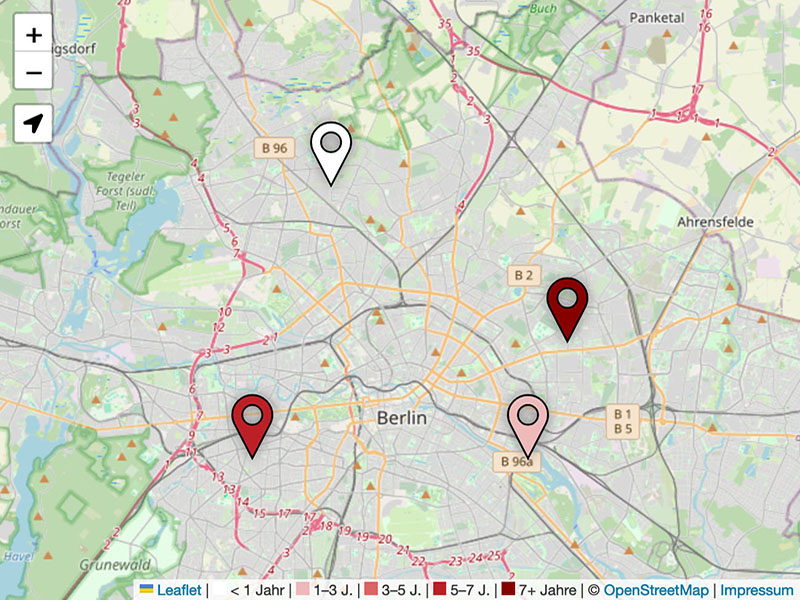

# Leerstand

Django app for managing places with json export and a fully-static frontend map.




## Deploy

Start container with `docker-compose up -d` and create admin user (first-run):

```sh
docker-compose exec app python manage.py createsuperuser --email ''
```
